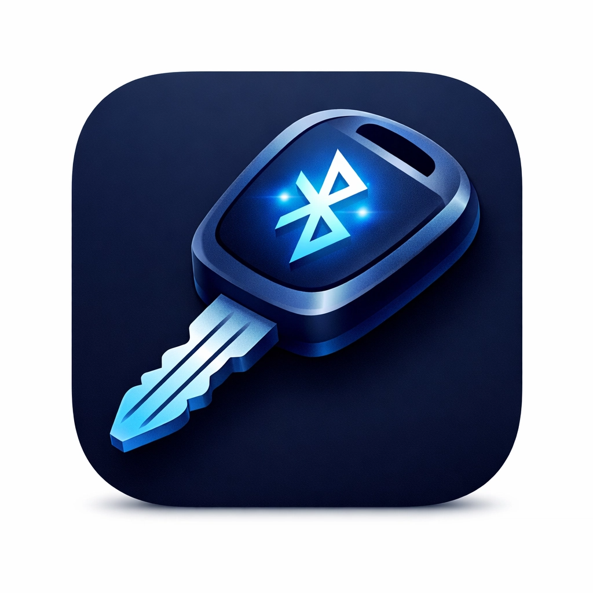

# 🔑 超低功耗蓝牙钥匙扣方案

**ESP32-C3 BLE Car Key Add-on**

一个基于 ESP32-C3 的超低功耗蓝牙钥匙扣外挂方案，通过 4 路光耦安全隔离连接原车钥匙 PCB，实现手机远程控制车辆 —— 开锁、关锁、开后备箱。



---

## ✨ 功能特性

- **🔵 超低功耗** — 5600mAh 锂电池供电，电路平均电流 < 8μA，实际使用寿命约 2.5~3 年（受电池自放电限制），支持 USB-C 充电
- **🔒 安全认证** — BLE 配对 + 6位动态 PIN 码，支持修改，5次失败自动防暴力熔断
- **📱 微信小程序** — 无需安装独立 App，微信内即可控制
- **🌐 Web App** — 基于 React + Capacitor，可打包为 Android 原生 App
- **⚡️ 光耦隔离** — 4 路光耦彻底隔离原车钥匙电路，保护原车安全
- **🛡️ 防暴力破解** — 连续 5 次 PIN 错误后，关闭蓝牙广播 3 分钟

---

## 🏗️ 项目结构

```
.
├── firmware/               # ESP32-C3 固件（Arduino）
│   └── firmware.ino
├── miniapp/                # 微信小程序控制端
│   ├── app.js
│   ├── app.json
│   └── pages/
├── web_app/                # Web App（React + Capacitor，可打包 Android APK）
│   ├── client/
│   ├── server/
│   └── android/
├── docs/                   # 设计文档与使用指南
│   ├── 硬件方案设计.md
│   ├── IMPLEMENTATION_GUIDE.md
│   ├── iPhone_BLE_Tool_Guide.md
│   ├── iPhone_Control_Summary.md
│   └── WeChat_MiniApp_Guide.md
└── assets/                 # 项目资源图片
```

---

## 🚀 快速开始

### 第一步：硬件准备（30-60 分钟）

所需物料：
| 组件 | 描述 |
|---|---|
| ESP32-C3 模组 | 主控芯片，负责 BLE 与 GPIO |
| 4 路光耦隔离模块 | 隔离 ESP32 与原车钥匙电路 |
| 5V 锂电池（5600mAh）| 独立供电，支持 USB-C 充电 |
| MCP1700-3302 LDO | 5V 降压至 3.3V，静态电流仅 1.6μA |
| 1μF 陶瓷电容 × 2 | LDO 输入/输出端去耦稳压 |
| 限流电阻 430Ω × 4 | 保护光耦 LED |

详细接线请参考 → [硬件方案设计](docs/硬件方案设计.md)

### 第二步：烧录固件（10-15 分钟）

1. 安装 [Arduino IDE](https://www.arduino.cc/en/software)，并安装 ESP32 开发板支持包
2. 打开 `firmware/firmware.ino`
3. 开发板选择 **ESP32C3 Dev Module**
4. 上传固件

**固件关键参数（首次使用前请修改 PIN 码）：**
```cpp
#define DEVICE_NAME "CarKey_BLE"          // 蓝牙设备名
uint32_t devicePasskey = 123456;          // 初始 PIN 码（首次配对后建议修改）
#define SERVICE_UUID "4fafc201-..."       // BLE Service UUID
```

### 第三步：手机控制

#### 方案 A：微信小程序（推荐）
使用微信开发者工具打开 `miniapp/` 目录，部署到自己的微信小程序账号即可。
详情参考 → [微信小程序指南](docs/iPhone_控制方案_2：微信小程序开发指南.md)

#### 方案 B：BLE 调试工具（立即可用）
下载 **LightBlue** 或 **nRF Connect** App，5 分钟内即可开始使用。
详情参考 → [BLE 调试工具指南](docs/iPhone_控制方案_1：BLE_调试工具使用指南.md)

#### 方案 C：Android 原生 App
```bash
cd web_app
pnpm install
pnpm dev        # 本地调试
# 或打包为 APK：
pnpm build
npx cap sync android
```

---

## 📡 BLE 协议说明

| 参数 | 值 |
|---|---|
| Service UUID | `4fafc201-1fb5-459e-8fcc-c5c9c331914b` |
| Characteristic UUID | `beb5483e-36e1-4688-b7f5-ea07361b26a8` |
| 配对方式 | BLE Secure Connections + PIN (MITM) |
| 广播间隔 | 200ms ~ 300ms |
| TX 功率 | 0 dBm |

**控制指令（向 Characteristic 写入 UTF-8 字符串）：**

| 指令 | 功能 |
|---|---|
| `UNLOCK` | 开锁 |
| `LOCK` | 关锁 |
| `TRUNK` | 开后备箱 |
| `SETPASS:XXXXXX` | 修改 PIN 码（须6位数字）|

---

## ⚡️ 功耗分析

| 工作模式 | 电流 | 占比 |
|---|---|---|
| Deep Sleep (ESP32 + LDO 静态) | ~6.6 μA | 99.9% |
| BLE 广播 (Light Sleep) | ~200 μA | 0.09% |
| 执行指令 (Active) | ~80 mA | 0.01% |
| **平均** | **< 8 μA** | — |

**电池方案**：5600mAh / 5V 锂电池 + MCP1700-3302 LDO (Iq = 1.6μA)

**理论续航**：电路平均电流约 7.6μA，理论值超 80 年；**实际瓶颈为锂电池自放电**（每月 ~3%），实际可用约 **2.5~3 年**，支持 USB-C 充电续命。

---

## 🔒 安全机制

- 所有指令须经 BLE MITM 认证加密后才能执行（双重硬件锁）
- 5 次 PIN 错误 → 广播关闭 3 分钟（防暴力破解）
- 断开连接后立即重置为未认证状态
- `SETPASS` 修改密码后强制清除配对缓存，需重新配对

---

## 📚 文档目录

| 文档 | 说明 |
|---|---|
| [硬件方案设计](docs/硬件方案设计.md) | 电路原理、接线图、功耗分析 |
| [实施指南](docs/IMPLEMENTATION_GUIDE.md) | 完整的组装、烧录、部署流程 |
| [BLE 调试工具指南](docs/iPhone_BLE_Tool_Guide.md) | LightBlue / nRF Connect 使用说明 |
| [微信小程序指南](docs/iPhone_控制方案_2：微信小程序开发指南.md) | 完整小程序代码与部署 |
| [控制方案对比](docs/iPhone_Control_Summary.md) | 三种控制方案对比与选择 |

---

## 🛠️ 技术栈

| 层次 | 技术 |
|---|---|
| 硬件主控 | ESP32-C3 |
| 固件 | Arduino / ESP-IDF (通过 Arduino 框架) |
| 手机端（小程序）| 微信小程序 (原生 WXML/JS) |
| 手机端（Web App）| React + TypeScript + Capacitor |
| BLE 协议 | BLE 5.0, GATT, Secure Connections |

---

## ⚠️ 免责声明

本项目仅供技术学习与个人研究使用。改装车辆电子设备存在潜在风险，请确保：
- 了解并遵守当地的交通和改装法规
- 改装前备份原车钥匙功能
- 不在公共道路上进行未经验证的改装测试

---

## 🙏 感谢支持

本项目的开发过程中得到了以下 AI 工具的协助，特此致谢：

- **[Manus](https://manus.im)** 
- **[Antigravity](https://antigravity.dev)** 

- 协助完成项目文档整理、开源结构规范化，以及硬件方案文档的撰写与更新

- 协助完成固件代码优化、微信小程序与 Web App 的开发调试
---

## 📄 License

[MIT License](LICENSE) © 2026 sjx
