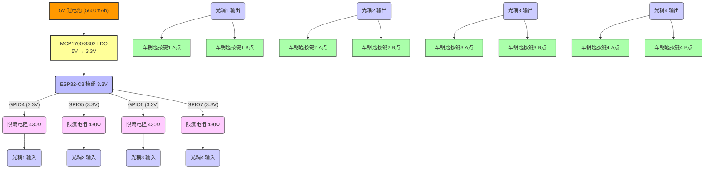

# 硬件方案设计

## 1. 核心组件

本方案将采用以下核心组件：

*   **ESP32-C3 模组**：作为主控芯片，负责蓝牙通信、低功耗管理和光耦驱动。选择体积小巧、支持低功耗模式的模组。
*   **4 路光耦隔离模块**：用于安全隔离 ESP32-C3 与原车钥匙电路，避免互相干扰和损坏。光耦的输出端将模拟原车钥匙按钮的按下动作。
*   **5V 锂电池（5600mAh）**：提供独立电源，容量大、续航极长，支持 USB-C 充电，适合长期固定安装场景。
*   **低压差线性稳压器（LDO）— MCP1700-3302**：将锂电池的 5V 输出稳压至 ESP32-C3 所需的 3.3V。MCP1700 系列静态电流极低（典型值 1.6μA），非常适合超低功耗应用。

## 2. 电路原理图概述

整体电路包括 ESP32-C3 最小系统、5V 锂电池 + LDO 降压供电，以及光耦隔离部分。

### 2.1 供电部分

5V/5600mAh 锂电池通过 **MCP1700-3302 LDO** 稳压后输出稳定的 3.3V，为 ESP32-C3 及光耦输入侧供电。

*   **输入电压**：5V（锂电池标称输出）
*   **输出电压**：3.3V（MCP1700-3302 固定输出）
*   **LDO 静态电流**（Iq）：~1.6μA（不驱动负载时），对续航影响极小
*   **去耦电容**：LDO 输入端并联 1μF 陶瓷电容，输出端并联 1μF 陶瓷电容，保证稳定性

### 2.2 ESP32-C3 部分

ESP32-C3 模组将配置为低功耗蓝牙 (BLE) 外设，主要利用其 Light-sleep 模式和 Deep-sleep 模式。GPIO 引脚将用于驱动光耦的输入端。

### 2.3 光耦隔离部分

4 路光耦隔离模块的输入端（LED 侧）通过限流电阻连接到 ESP32-C3 的 GPIO 引脚。当 ESP32-C3 的 GPIO 输出高电平时，光耦的 LED 会被点亮。光耦的输出端（光敏三极管侧）将连接到原车钥匙的按钮触点上，模拟按钮按下时的短路状态。

**关键考虑：**

*   **隔离**：光耦确保 ESP32-C3 的电路与车钥匙电路完全电气隔离，防止电流倒灌或电压不匹配造成损坏。
*   **模拟按键**：光耦输出端需要正确连接到车钥匙 PCB 上对应按键的触点，通常是连接到按键的两端，使其在导通时模拟按键按下。

## 3. 接线图（示意）

以下是一个简化的接线示意图，具体引脚和电阻值需根据实际选用的 ESP32-C3 模组和光耦模块进行调整。

**接线说明：**

1.  **电源连接**：5V 锂电池正极接 MCP1700-3302 LDO 输入脚（IN），LDO 输出脚（OUT）输出稳定 3.3V，接 ESP32-C3 模组的 3V3 引脚；LDO GND 脚与电池负极和 ESP32 GND 共地。LDO 输入、输出端各并联一颗 1μF 陶瓷电容以保证稳定性。
2.  **光耦输入**：ESP32-C3 的四个 GPIO 引脚（GPIO4、GPIO5、GPIO6、GPIO7）分别通过一个限流电阻连接到 4 路光耦模块的输入端（LED 正极）。光耦输入端的 LED 负极连接到 GND。
    *   **限流电阻计算**：GPIO 输出电压 $V_{GPIO} = 3.3V$，光耦 LED 正向电压 $V_F = 1.2V$，驱动电流 $I_F = 5mA$。则 $R = (3.3V - 1.2V) / 5mA = 420\Omega$，选用标准阻值 **430Ω**。
3.  **光耦输出**：4 路光耦模块的输出端（光敏三极管集电极和发射极）分别连接到原车钥匙 PCB 上对应按键的两个触点，模拟按键按下时的短路状态。光耦输出侧悬浮，不需要额外供电，与车钥匙电路完全电气隔离。

## 4. 功耗估算与电池续航

本方案采用 **5600mAh / 5V 锂电池** 供电，配合 MCP1700-3302 LDO 降压至 3.3V，具备超长续航能力。

**各部件静态功耗：**

| 组件 | 工作状态 | 电流消耗 |
|---|---|---|
| MCP1700-3302 LDO | 静态（空载）| ~1.6 μA |
| ESP32-C3 | Deep-sleep | ~5 μA |
| ESP32-C3 | Light-sleep + BLE 广播 | ~200 μA |
| ESP32-C3 | Active（执行指令）| ~80 mA |
| 光耦（单路） | 驱动状态（100ms/次）| ~5 mA（瞬时）|

**ESP32-C3 功耗模式：**

*   **Deep-sleep 模式**：CPU、Wi-Fi 和蓝牙全部关闭，只有 RTC 计时器运行，功耗约 5μA。
*   **Light-sleep 模式**：CPU 暂停，BLE 保持广播，平均电流约 200μA。
*   **Active 模式**：BLE 连接建立、指令执行期间，电流约 80mA，但单次持续时间极短（< 500ms）。

**实现超低功耗策略：**

1.  **大部分时间处于 Deep-sleep 模式**，由 BLE 广播事件周期性唤醒。
2.  **周期性 BLE 广播**：广播间隔 200~300ms，在 Light-sleep 状态下执行，手机可快速发现设备。
3.  **连接即操作**：建立 BLE 连接后完成认证和指令执行，约 200~500ms 完成后立即断开。
4.  **光耦驱动时间极短**：每次 100ms 脉冲，对平均功耗影响可忽略。

**理论续航估算：**

假设设备 99.9% 的时间处于 Deep-sleep（5μA + LDO 静态 1.6μA = 6.6μA），0.09% 时间 Light-sleep 广播（200μA），0.01% 时间 Active（80mA）：

$I_{平均} = (0.999 \times 6.6\mu A) + (0.0009 \times 200\mu A) + (0.00001 \times 80000\mu A)$
$I_{平均} = 6.593\mu A + 0.18\mu A + 0.8\mu A \approx 7.6\mu A$

$$续航时间 = \frac{5600mAh}{0.0076mA} \approx 736,000h \approx 84年（理论值）$$

> **实际瓶颈**：锂电池每月自放电约 2~3%（约 112~168mAh/月），自放电等效电流约 **155~233μA**，远大于电路实际消耗，真正决定续航的是**电池自放电**。
>
> **实际估算**：以每月 3% 自放电率计算，5600mAh 电池可使用约 **2.5~3 年**，无需关心电路功耗，支持 USB-C 充电续命。

## 5. 安全性考虑

*   **BLE 配对与绑定**：ESP32-C3 将配置为使用 BLE 安全连接 (Secure Connections) 和固定 PIN 码进行配对。这意味着只有知道正确 PIN 码的手机才能与设备建立安全连接。
*   **无 UI 验证**：由于设备没有屏幕或按键用于显示/输入 PIN 码，将采用预设的固定 PIN 码。在首次配对时，手机端需要输入此 PIN 码。
*   **隐藏广播**：在非配对状态下，可以考虑使用非可连接的广播模式，或者在配对成功后停止广播，只在特定条件下（例如，通过物理按键唤醒）才进行广播，进一步提高安全性并降低功耗。
*   **距离限制**：蓝牙信号强度将限制在 3-5 米范围内，超出范围无法连接，增加物理安全性。

## 6. 待解决问题与后续步骤

*   **原车钥匙按键触点识别**：需要拆开原车钥匙，识别出开锁、关锁、开后备箱等按键对应的 PCB 触点，以便正确连接光耦输出。
*   **ESP32-C3 模组选择**：选择一款体积小巧、引脚易于焊接、且具有良好低功耗表现的 ESP32-C3 模组。
*   **光耦模块选择**：选择一款小体积、低功耗、且输出端能承受车钥匙电路电压和电流的光耦模块。
*   **固件开发**：实现 BLE 广播、连接、安全配对、指令解析、GPIO 控制以及最重要的低功耗管理逻辑。
*   **手机 App 开发**：实现 BLE 扫描、连接、PIN 码输入、指令发送等功能。

下一步将开始编写 ESP32-C3 的固件代码，重点关注 BLE 协议栈的配置、安全连接的实现以及 Deep-sleep/Light-sleep 模式的切换和唤醒机制。
